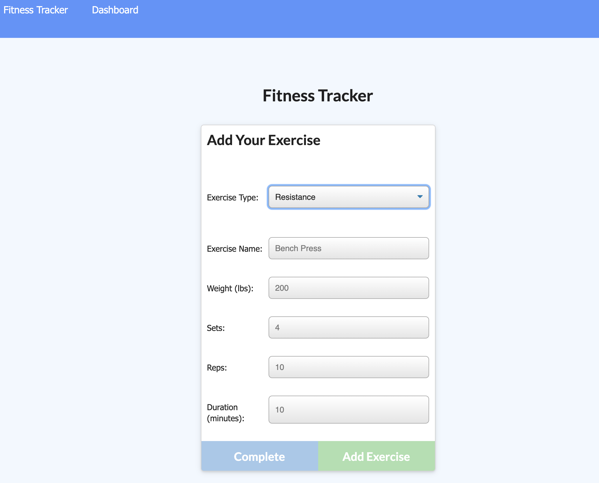
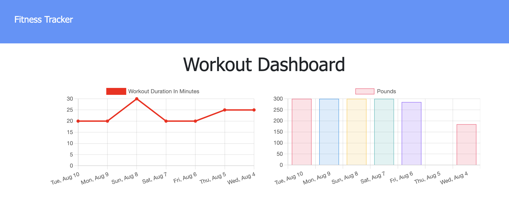

# fitness-tracke

## Table of Contents

*[Usage](#usage)

*[License](#license)

*[Contributing](#contributing)

*[Tests](#tests)

*[Questions](#questions)

## Description

This application will allow you to track workouts, aggregate the duration, and display past workouts on a graph

## Installation

To install necessary dependencies, run the following command:
...
npm i
...

## Usage

The user should be able to utilize this Node application through Node, Git Bash, or a Terminal

## License

This project is licensed under the MIT license

## Contributing

Contributions are welcome to improve coding efficiency

## Tests

To run tests, run the following command:
...
npm test
...

## Questions

If you have any questions about the repo, open an issue or contact me directly at scotty.d.phillips@gmail.com. You can find more of my work at https://github.com/scottydphillips

Link to Deployed Application: https://agile-thicket-53662.herokuapp.com/

## Screenshots

